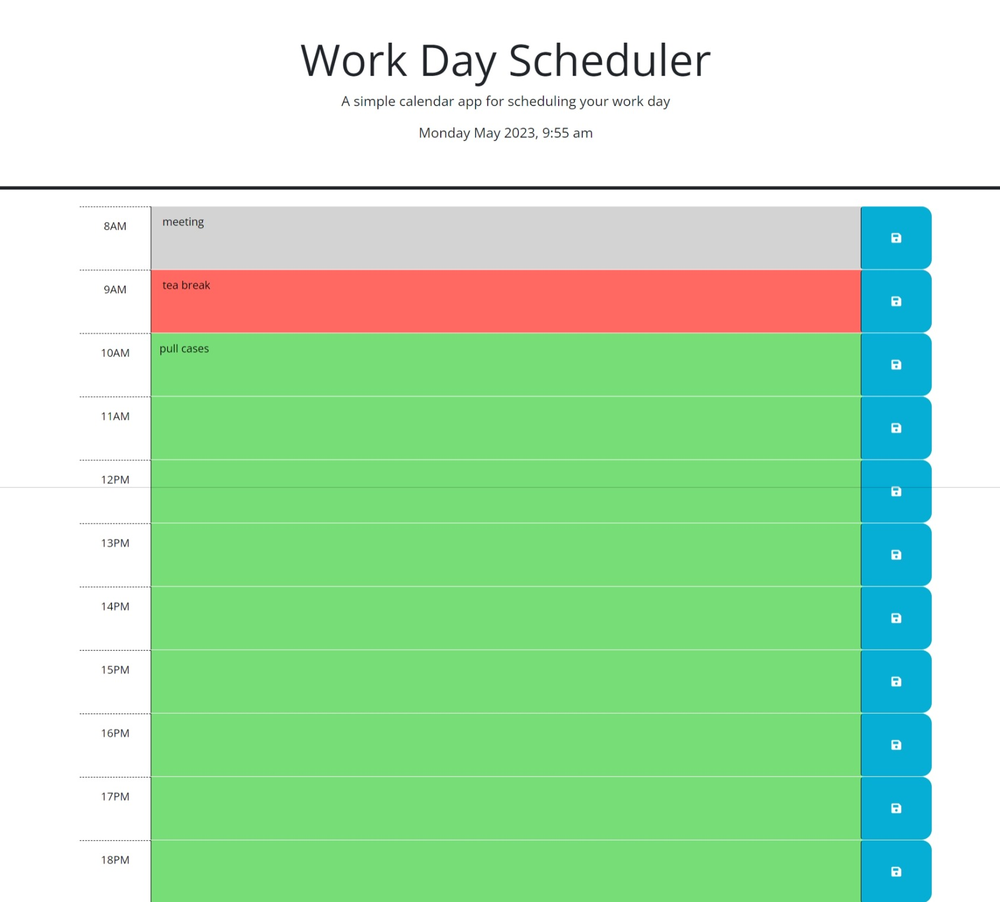

# Work-Day-Scheduler-JS
Add logic to Work Day Scheduler using JQuery and Dayjs.

## Description

App to schedule events for the workday to help keep your day organized. Schedule is color-coded so that past events are in gray, present events are red and future events will be in green. The top of the screen shows the current date and time.

## Table of Contents
N/A

## Installation 

Simply open the app by going to https://silvag6271.github.io/Work-Day-Scheduler-JS/ and start entering your scheduled events.

## Usage
Keep track of your daily schedule by using this app to save events. Just enter your event in the block corresponding to it's time and push the save icon. The color-coding will visually alert you to whether the event is a past, present or future one.

## Credits

Starter code was provided by "Xandromus" at https://github.com/coding-boot-camp/crispy-octo-meme. Also received coding help from the github of user name "nsc9605" at https://github.com/nsc9605/WorkDay_Scheduler.  

## License

Please refer to the license in the repo
